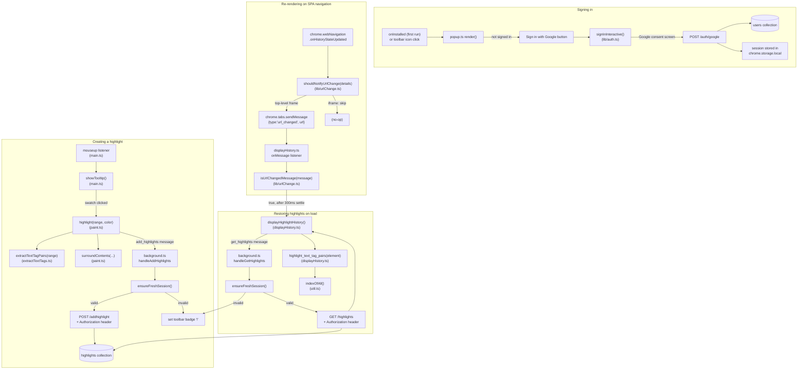

# Frontend Function Index

Top-down reference for every function in the Chrome Highlighter frontend.
Each function has inline TypeScript types — hover in VS Code for the signature,
`Ctrl+Shift+O` for a per-file outline, `Ctrl+T` to jump to any symbol across
the whole project.

> **Content scripts are bundled, not raw ES modules.** Chrome's static
> `content_scripts` array doesn't support real ES modules the way the
> service worker does, so only the two entry points are listed in
> `manifest.json` (`content/main.js`, `content/displayHistory.js`) and they —
> plus everything they import (`util.ts`, `extractTextTags.ts`, `paint.ts`,
> `lib/urlChange.ts`) — are bundled into standalone, import-free files by
> **esbuild** (`npm run bundle-content`), not by `tsc` itself.

## Chrome Extension Code Execution Order

**Background service worker** (`background.ts`) — initializes first, boots when
the extension loads or an event it listens to triggers.

**Popup** (`popups/popup.ts`) — runs only when the user opens the toolbar popup
or the onboarding tab.

**Content scripts** (`content/main.ts`, `content/displayHistory.ts`) — injected
as ES modules into every matching page. Each entry point imports its own
dependencies; there is no shared global scope between them.

## Index

| File | Function | Signature | Purpose | Calls |
|---|---|---|---|---|
| `background.ts` | `onInstalled` listener | — | On first install, opens `popups/popup.html` as a full tab so a new user is prompted to sign in immediately | — |
| `background.ts` | `handleGetHighlights` | `(msg: GetHighlightsMessage, ...) => true` | Ensures a fresh session, then `GET /highlights`; responds `{error:"auth_required"}` + sets toolbar badge if not signed in | `ensureFreshSession`, backend API |
| `background.ts` | `handleAddHighlights` | `(msg: AddHighlightsMessage, ...) => true` | Ensures a fresh session, then `POST /addhighlight`; responds `{error:"auth_required"}` + sets toolbar badge if not signed in | `ensureFreshSession`, backend API |
| `background.ts` | `clearAuthBadge` | `() => void` | Clears the `"!"` toolbar badge after a successful request | — |
| `background.ts` | `setAuthBadge` | `() => void` | Sets a red `"!"` badge nudging the user to re-sign-in | — |
| `background.ts` | `onHistoryStateUpdated` listener | — | Fires on SPA (same-document) navigations, e.g. `history.pushState` link clicks. Forwards a `url_changed` message to the tab's content script so it can re-render highlights for the new URL | `shouldNotifyUrlChange`, `chrome.tabs.sendMessage` |
| `lib/urlChange.ts` | `shouldNotifyUrlChange` | `(details: {frameId: number}) => boolean` | `frameId === 0` check — ignores iframe-internal navigations so only top-level URL changes trigger a re-render | — |
| `lib/urlChange.ts` | `isUrlChangedMessage` | `(message: unknown) => message is UrlChangedMessage` | Type guard for the `url_changed` message shape | — |
| `lib/auth.ts` | `getSession` | `() => Promise<Session \| null>` | Reads `{sessionToken, expiresAt, user}` from `chrome.storage.local` | — |
| `lib/auth.ts` | `saveSession` | `(session: Session) => Promise<void>` | Writes session to `chrome.storage.local` | — |
| `lib/auth.ts` | `clearSession` | `() => Promise<void>` | Removes session from storage | — |
| `lib/auth.ts` | `ensureFreshSession` | `() => Promise<Session \| null>` | Returns a valid session, silently refreshing via `chrome.identity.getAuthToken({interactive:false})` + `POST /auth/google` if expired; `null` if silent refresh fails | Google Identity API, backend `/auth/google` |
| `lib/auth.ts` | `signInInteractive` | `() => Promise<Session>` | Shows Google's consent screen (`{interactive:true}`) and exchanges the token; must be called from a real user gesture | Google Identity API, backend `/auth/google` |
| `lib/auth.ts` | `signOut` | `() => Promise<void>` | Revokes the cached Google token and clears the stored session | Google Identity API |
| `popups/popup.ts` | `render` | `() => Promise<void>` | Shows "Signed in as {email}" + Sign out, or a Sign in button, based on the stored session | `getSession` |
| `popups/popup.ts` | Sign-in / Sign-out handlers | — | Call `signInInteractive()` / `signOut()` and re-render; closes the tab if opened as the onboarding tab | `lib/auth.ts` |
| `content/main.ts` | `mouseup` listener | — | Detects a text selection (2ms debounce) and shows the color-picker tooltip | `showTooltip`, `removeTooltip` |
| `content/main.ts` | `showTooltip` | `(selection: Selection) => void` | Renders a floating 4-swatch color-picker near the selection start | `removeTooltip`, `highlight` |
| `content/main.ts` | `removeTooltip` | `(where: string) => void` | Removes the tooltip element from the DOM | — |
| `content/paint.ts` | `highlight` | `(range: Range, color: string) => void` | Applies the chosen color to the selection and sends it to the backend to be saved | `extractTextTagPairs`, `surroundContents`, background (`add_highlights`) |
| `content/paint.ts` | `surroundContents` | `(text_nodes: TextNodeEntry[], startOffset: number, endOffset: number, color?: string) => void` | Wraps the selected text nodes in colored ``s; sets `backgroundColor` on parent elements of middle nodes | — |
| `content/extractTextTags.ts` | `extractTextTagPairs` | `(range: Range) => [TextTagPair[], TextNodeEntry[], number, number]` | Walks the range's text nodes, records `{text, tag}` pairs used to relocate the highlight on reload | — |
| `content/util.ts` | `indexOfAll` | `(str: string, needle: string) => number[]` | Returns all non-overlapping match indices of `needle` in `str` | — |
| `content/displayHistory.ts` | `displayHighlightHistory` | `() => Promise<void>` | Runs on injection, and again on every SPA URL change; fetches saved highlights for the page and re-applies them; silently skips on auth failure | background (`get_highlights`), `highlight_text_tag_pairs` |
| `content/displayHistory.ts` | `highlight_text_tag_pairs` | `(element: HighlightRecord) => number \| undefined` | Re-locates one saved highlight's text/tag sequence on the page and re-wraps it in colored spans. Naturally idempotent: once a node is wrapped, its parent tag becomes `SPAN`, so re-running against already-highlighted content is a no-op instead of double-wrapping | `indexOfAll` |
| `content/displayHistory.ts` | `onMessage` listener (`url_changed`) | — | On SPA navigation, waits `SPA_RENDER_SETTLE_MS` (300ms, for the framework's async re-render) then re-runs `displayHighlightHistory` | `isUrlChangedMessage`, `displayHighlightHistory` |

## Shared Types (`types.ts`)

| Type | Shape |
|---|---|
| `GoogleUser` | `{ email: string; name?: string; picture?: string; sub?: string }` |
| `Session` | `{ sessionToken: string; expiresAt: number; user: GoogleUser }` |
| `TextTagPair` | `{ text: string; tag: string }` |
| `TextNodeEntry` | `{ node: Text; text: string }` |
| `HighlightRecord` | `{ id?, text, tag?, text_tag_pairs, startOffset, endOffset, color?, url? }` |
| `GetHighlightsMessage` | `{ type: "get_highlights"; url: string }` |
| `UrlChangedMessage` | `{ type: "url_changed"; url: string }` — background → content script, on SPA navigation |
| `AddHighlightsMessage` | `{ type: "add_highlights"; url, text, tag?, text_tag_pairs, startOffset, endOffset, color }` |
| `GetHighlightsResponse` | `{ highlights: HighlightRecord[] } \| { error: string }` |
| `AddHighlightsResponse` | `{ highlight: HighlightRecord } \| { error: string }` |

## Call-flow diagram

Four flows: **signing in**, **creating** a highlight, **restoring** saved
highlights on page load, and **re-rendering on SPA navigation**.
Creating/restoring both gate on a valid session first.

