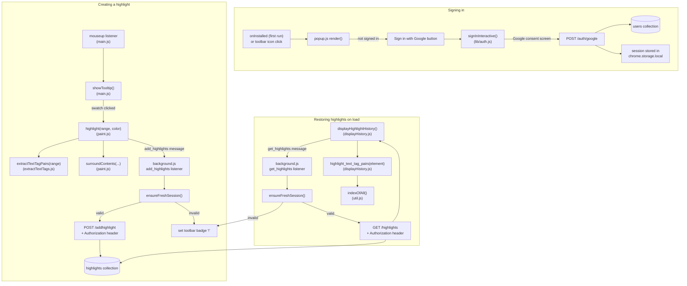

# Frontend Function Index

Top-down reference for every function in the Chrome Highlighter frontend.
Each function also has a JSDoc comment in its source file (hover it in
VS Code, or `Ctrl+Shift+O` for a per-file outline, `Ctrl+T` to jump to any
symbol by name across the whole project).

> **Note:** `popups/popup.js` is now wired up as `manifest.json`'s
> `default_popup` and handles Google sign-in/sign-out. The old
> `chrome.action.onClicked` content-script injection in `background.js` is
> commented out — content scripts are auto-injected instead, via the static
> `content_scripts` entry in `manifest.json`.

## Chrome Extension Code Execution Flow

Background Service Worker: This initializes first. It boots up immediately when the extension loads or when an event it listens to triggers.

Popup / Options Pages: These HTML files and their linked scripts only execute when a user explicitly clicks the extension icon or opens the options page.

Content Scripts: These run only when a web page matches the target URLs defined in the extension's configuration.

content_scripts[0].js: order matters in principle — Chrome loads and executes these files sequentially, in the order listed, into one shared global scope. The current order (`util.js`, `extractTextTags.js`, `paint.js`, `main.js`, `displayHistory.js`) matches the real dependency order between them.

## Index

| File | Function | Purpose | Calls |
|---|---|---|---|
| `background.js` | `chrome.action.onClicked` listener | _(commented out — content scripts now auto-inject via manifest)_ | — |
| `background.js` | `onInstalled` listener | On first install, opens `popups/popup.html` as a full tab so a new user is prompted to sign in immediately | — |
| `background.js` | `get_highlights` message listener | Ensures a fresh session (`ensureFreshSession`), then `GET /highlights` from backend with `Authorization` header; responds `{error: "auth_required"}` + sets toolbar badge if not signed in | `lib/auth.js` (`ensureFreshSession`), backend API |
| `background.js` | `add_highlights` message listener | Ensures a fresh session, then `POST /addhighlight` with `Authorization` header; responds `{error: "auth_required"}` + sets toolbar badge if not signed in | `lib/auth.js` (`ensureFreshSession`), backend API |
| `lib/auth.js` | `getSession()` / `saveSession()` / `clearSession()` | Read/write the session (`{sessionToken, expiresAt, user}`) in `chrome.storage.local` | — |
| `lib/auth.js` | `ensureFreshSession()` | Returns a valid session, silently refreshing via `chrome.identity.getAuthToken({interactive:false})` + `POST /auth/google` if expired; `null` if silent refresh fails | Google Identity API, backend `/auth/google` |
| `lib/auth.js` | `signInInteractive()` | Shows Google's consent screen (`{interactive:true}`) and exchanges the token; called from the popup's Sign-in button (real user gesture) | Google Identity API, backend `/auth/google` |
| `lib/auth.js` | `signOut()` | Revokes the cached Google token and clears the stored session | Google Identity API |
| `popups/popup.js` | `render()` | Shows "Signed in as {email}" + Sign out, or a Sign in button, based on the stored session. Runs as both the toolbar popup and the one-time onboarding tab | `lib/auth.js` (`getSession`) |
| `popups/popup.js` | Sign-in / Sign-out button handlers | Call `signInInteractive()` / `signOut()` and re-render; closes the tab automatically if opened as the onboarding tab | `lib/auth.js` |
| `content/main.js` | `mouseup` listener | Detects a text selection and shows the color-picker tooltip | `showTooltip`, `removeTooltip` |
| `content/main.js` | `showTooltip(selection)` | Renders the floating color-swatch tooltip near the selection | `removeTooltip`, `highlight` |
| `content/main.js` | `removeTooltip(where)` | Removes the tooltip element from the DOM | — |
| `content/paint.js` | `highlight(range, color)` | Applies the chosen color to the selection and sends it to the backend to be saved; if the response is `{error: "auth_required"}`, logs and skips (badge already shown by background.js) | `extractTextTagPairs`, `surroundContents`, background.js (`add_highlights`) |
| `content/paint.js` | `surroundContents(range, text_nodes, startOffset, endOffset, color)` | Wraps the selected text nodes in colored ``s / backgrounds | `extractTextTagPairs` (fallback) |
| `content/extractTextTags.js` | `extractTextTagPairs(range)` | Walks the range's text nodes, records `{text, tag}` pairs used to relocate the highlight later | — |
| `content/util.js` | `indexOfAll(str, needle)` | Returns all match indices of `needle` in `str` | — |
| `content/displayHistory.js` | `displayHighlightHistory()` | Runs on injection; fetches saved highlights for the page and re-applies them; if the response is `{error: "auth_required"}`, logs and skips | background.js (`get_highlights`), `highlight_text_tag_pairs` |
| `content/displayHistory.js` | `highlight_text_tag_pairs(element)` | Re-locates one saved highlight's text/tag sequence on the page and re-wraps it in colored spans | `indexOfAll` |

## Call-flow diagram

Three flows: **signing in**, **creating** a highlight, and **restoring**
saved highlights on page load. Creating/restoring both gate on a valid
session first.

