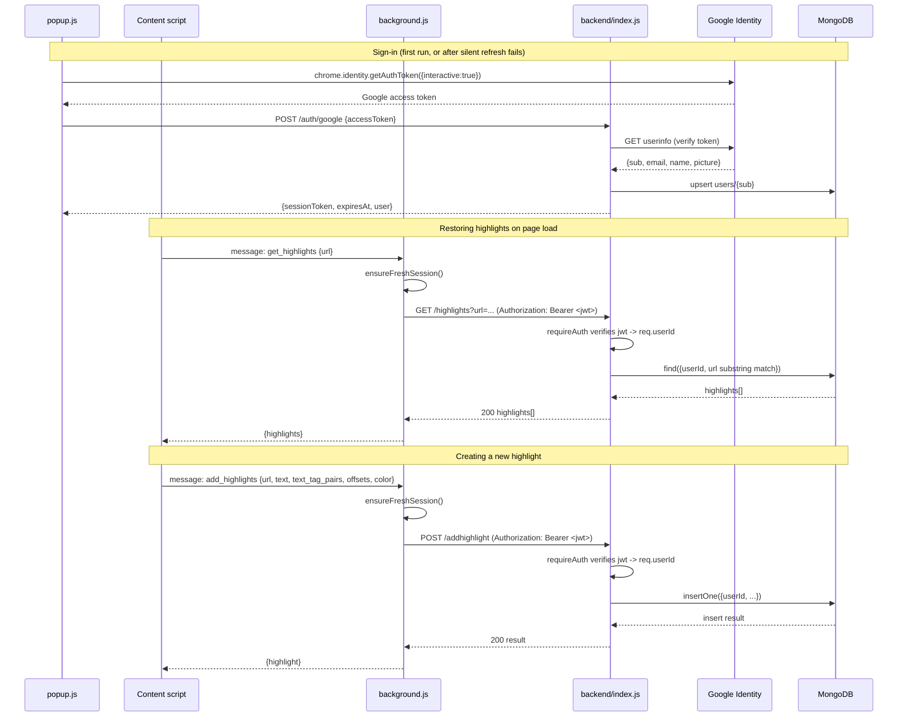

# Backend Function Index

Top-down reference for `backend/index.js` and `backend/auth.js` — an
Express server backed by MongoDB, with Google-sign-in-based sessions. Each
function/route also has a JSDoc comment in-source (hover it in VS Code,
`Ctrl+Shift+O` for a file outline).

## Index

| Function / Route | Purpose | Called by |
|---|---|---|
| `connectDB()` | Connects to MongoDB (`MONGO_URI`), assigns the `highlighter` db to module-level `db` | startup (bottom of `index.js`, before `app.listen`) |
| `POST /auth/google` | Verifies a Google access token, upserts a `users` document, mints a 7-day session JWT | `lib/auth.js`'s `exchangeGoogleToken` (extension) |
| `GET /highlights` | Returns the signed-in user's saved highlights for a page, matched by substring either direction against the stored `url`. Requires `requireAuth`. | `background.js`'s `get_highlights` listener |
| `POST /addhighlight` | Inserts one highlight document, tagged with `req.userId`, into the `highlights` collection. Requires `requireAuth`. | `background.js`'s `add_highlights` listener |
| `verifyGoogleToken(accessToken)` (`auth.js`) | Calls Google's userinfo endpoint to verify the token and get `{sub, email, name, picture}` | `POST /auth/google` |
| `issueSession(user)` (`auth.js`) | Signs a 7-day session JWT (`{sub, email}`) with `JWT_SECRET` | `POST /auth/google` |
| `requireAuth` middleware (`auth.js`) | Verifies the `Authorization: Bearer <jwt>` header, sets `req.userId`, else `401` | `GET /highlights`, `POST /addhighlight` |

## Request flow

## Notes

- No `PUT`/`DELETE` routes yet — highlights can be created and read, not
  updated or removed (see the `//update highlights` / `//edit or delete
  highlights` TODO comments in `background.js`).
- `MONGO_URI`, `PORT`, and `JWT_SECRET` are read from `.env` (`dotenv`) —
  not committed to the repo, so a missing `.env` will fail `connectDB()` /
  `requireAuth` at startup or on first request.
- The `tag` field accepted by `POST /addhighlight` is never actually sent by
  `background.js`'s `add_highlights` listener — it's always `undefined` in
  practice.
- Session model: the extension never sends the Google access token to
  `/highlights` or `/addhighlight` — only the backend-issued JWT from
  `/auth/google`. Google is only contacted at sign-in / silent-refresh time,
  not on every highlight save (see `Chrome Highlighter/lib/auth.js`).
- `req.userId` (the Google `sub`) is the sole source of truth for who owns a
  highlight — nothing client-supplied is trusted for that.
